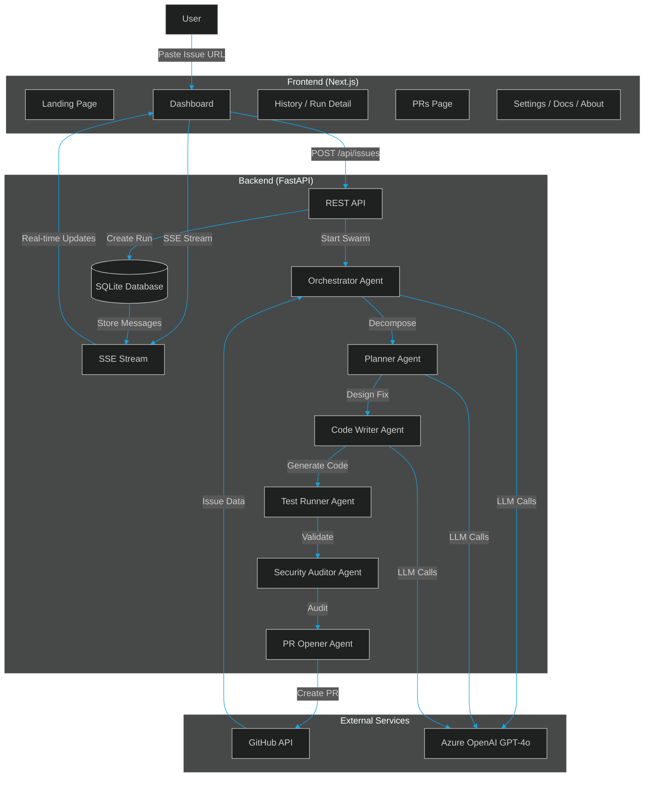
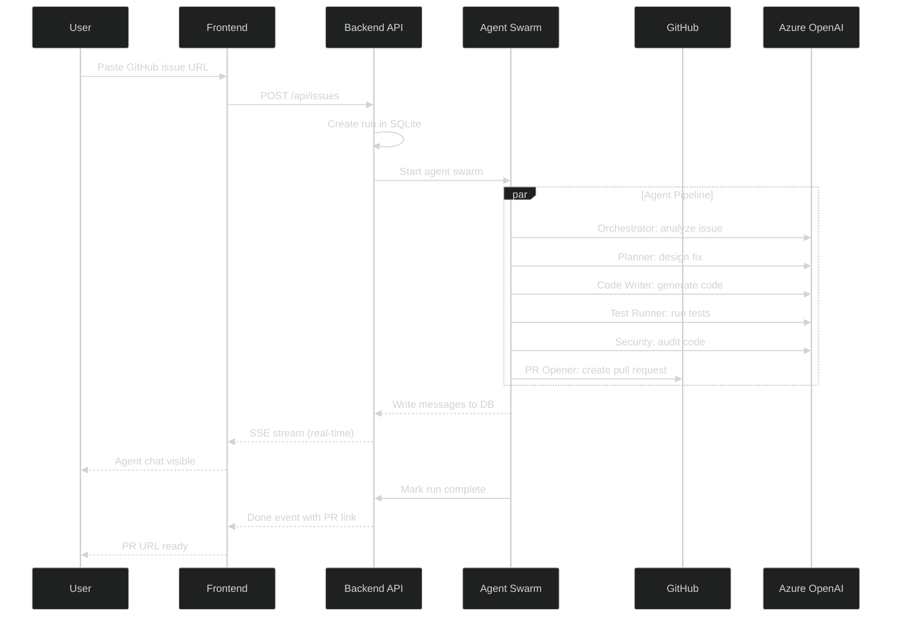

# SwarmOps — Autonomous DevOps Agent Swarm

**GitHub Issue → Agents Plan, Code, Test, Audit → PR opened. Zero humans.**

Built for **Microsoft Build with AI 2026** — Theme: Agent Swarms, Multi-Agent Orchestration

---

## Architecture



### Flow



---

## Prerequisites

| Tool | Version | Purpose |
|------|---------|---------|
| Python | 3.11+ | Backend runtime |
| Node.js | 18+ | Frontend runtime |
| Git | Any | Version control |
| Azure account | Free tier | OpenAI API access |
| GitHub token | `repo` scope | Read issues, create PRs |

---

## Quick Setup

### 1. Backend

```bash
cd backend
python -m venv venv
source venv/Scripts/activate   # Windows
# source venv/bin/activate     # macOS/Linux
pip install -r requirements.txt
```

Edit `backend/.env` with your credentials:
- `GITHUB_TOKEN` — Create at [github.com/settings/tokens](https://github.com/settings/tokens) with `repo` scope
- `AZURE_OPENAI_*` — Get from Azure Portal (your friend provides these)

```bash
run.bat   # Windows
# uvicorn main:app --reload --port 8000   # macOS/Linux
```

### 2. Frontend

```bash
cd frontend
npm install
npm run dev
```

Open **http://localhost:3000** (dev) or **http://localhost** (Docker)

### 3. Docker (production-like, one command)

```bash
cp .env.example .env
# Edit .env — add GEMINI_API_KEY, GITHUB_TOKEN, or Azure OpenAI keys
docker compose up --build -d
```

Open **http://localhost** (nginx serves UI and proxies `/api` to the backend).

Windows: run `start-docker.bat`

See **[DEPLOY.md](DEPLOY.md)** for Azure Container Apps, Static Web Apps, and CI details.  
See **[HACKATHON.md](HACKATHON.md)** for judge demo script and pitch.

---

## API Reference

| Method | Endpoint | Description |
|--------|----------|-------------|
| `GET` | `/health` | Health check |
| `POST` | `/api/issues` | Trigger agent swarm on a GitHub issue |
| `GET` | `/api/issues/{run_id}` | Get run status and agent states |
| `GET` | `/api/stream/{run_id}` | SSE real-time agent message stream |
| `GET` | `/api/prs/{run_id}` | Get PR details for a run |
| `GET` | `/api/prs` | List all created PRs |
| `GET` | `/api/runs` | List all runs (paginated, filterable by status) |
| `GET` | `/api/runs/stats` | Aggregate run statistics |

### Trigger a Run

```bash
curl -X POST http://localhost:8000/api/issues \
  -H "Content-Type: application/json" \
  -d '{
    "github_url": "https://github.com/owner/repo/issues/42",
    "repo": "owner/repo",
    "issue_number": 42
  }'
```

---

## Pages

| Route | Page | Description |
|-------|------|-------------|
| `/` | Landing | Marketing page with hero, features, how-it-works |
| `/dashboard` | Dashboard | Issue input, agent chat, code diff, test+security results |
| `/history` | Run History | List of all past agent runs |
| `/runs/:runId` | Run Detail | Deep dive into a single run |
| `/prs` | Pull Requests | All PRs created by SwarmOps |
| `/pricing` | Pricing | Free / Pro / Enterprise tiers |
| `/login` | Sign In | Login form |
| `/signup` | Create Account | Registration form |
| `/docs` | Documentation | How it works, agent descriptions, FAQ |
| `/about` | About | Team, tech stack, hackathon info |
| `/settings` | Settings | GitHub token, repo, preferences |

---

## Project Structure

```
swarmops/
├── backend/
│   ├── main.py               # FastAPI app entry point
│   ├── config.py             # Settings from .env
│   ├── database.py           # SQLite + SQLAlchemy setup
│   ├── models.py             # Run, AgentMessage, AgentState
│   ├── swarm.py              # Agent orchestration
│   ├── requirements.txt      # Python dependencies
│   ├── run.bat               # Windows startup script
│   ├── .env                  # Credentials (gitignored)
│   ├── .env.example          # Template for .env
│   ├── api/
│   │   ├── issues.py         # POST /api/issues, GET /api/issues/{run_id}
│   │   ├── stream.py         # GET /api/stream/{run_id} (SSE)
│   │   ├── prs.py            # GET /api/prs, GET /api/prs/{run_id}
│   │   └── runs.py           # GET /api/runs, GET /api/runs/stats
│   ├── agents/
│   │   ├── base.py           # BaseAgent class
│   │   ├── orchestrator.py   # Reads issue, decomposes tasks
│   │   ├── planner.py        # Designs fix strategy
│   │   ├── code_writer.py    # Generates code diff
│   │   ├── test_runner.py    # Runs tests
│   │   ├── security_auditor.py # Scans for vulnerabilities
│   │   └── pr_opener.py      # Creates branch, commits, opens PR
│   └── services/
│       └── github.py         # GitHub API wrapper (PyGithub)
├── frontend/
│   ├── index.html            # HTML entry
│   ├── next.config.ts        # Next.js + API rewrites to backend
│   ├── tailwind.config.js    # Tailwind theme (dark)
│   ├── package.json          # Dependencies
│   ├── tsconfig.json         # TypeScript config
│   ├── .env                  # Frontend config (gitignored)
│   └── src/
│       ├── main.tsx          # React entry point
│       ├── App.tsx           # React Router with lazy-loaded routes
│       ├── Layout.tsx        # Shared nav + footer layout
│       ├── index.css         # Tailwind imports
│       ├── pages/            # 11 page components
│       │   ├── Landing.tsx
│       │   ├── Dashboard.tsx
│       │   ├── History.tsx
│       │   ├── RunDetail.tsx
│       │   ├── PRs.tsx
│       │   ├── Pricing.tsx
│       │   ├── Login.tsx
│       │   ├── Signup.tsx
│       │   ├── Docs.tsx
│       │   ├── About.tsx
│       │   └── Settings.tsx
│       ├── components/       # Shared UI components
│       │   ├── AgentChat.tsx
│       │   ├── AgentCard.tsx
│       │   ├── DiffViewer.tsx
│       │   ├── TestResults.tsx
│       │   ├── SecurityReport.tsx
│       │   └── PRStatus.tsx
│       ├── store/
│       │   └── agentStore.ts # Zustand state management
│       └── hooks/
│           └── useAgentStream.ts # SSE connection hook
├── PRDs/                     # Planning documents
├── docs/superpowers/         # Design docs and plans
├── README.md                 # This file
├── QUICKSTART.md             # Team quick start guide
└── .gitignore
```

---

## Tech Stack

### Backend
| Technology | Purpose |
|------------|---------|
| **FastAPI** | REST API + SSE streaming |
| **SQLite + SQLAlchemy** | Local database (zero config) |
| **AutoGen 0.4+** | Agent swarm orchestration |
| **Azure OpenAI / Gemini / Groq** | Agent reasoning via multi-provider LLM router |
| **PyGithub** | GitHub API integration |

### Frontend
| Technology | Purpose |
|------------|---------|
| **Next.js 16 + React** | App router, shadcn UI, API proxy |
| **TypeScript** | Type safety |
| **Tailwind CSS** | Styling (dark theme) |
| **React Router v6** | Client-side routing (lazy loaded) |
| **Zustand** | State management |
| **Monaco Editor** | Code diff display |
| **SSE (EventSource)** | Real-time agent message streaming |

---

## Agent Pipeline

```
┌─────────────┐    ┌─────────┐    ┌────────────┐    ┌────────────┐    ┌────────────────┐    ┌──────────┐
│ Orchestrator │───▶│ Planner │───▶│ Code Writer│───▶│Test Runner │───▶│Security Auditor│───▶│PR Opener │
│  Reads Issue │    │Designs  │    │  Generates │    │  Validates │    │   Scans for    │    │Creates   │
│  Decomposes  │    │  Fix    │    │  Code Diff │    │   Tests    │    │Vulnerabilities │    │   PR     │
└─────────────┘    └─────────┘    └────────────┘    └────────────┘    └────────────────┘    └──────────┘
```

Each agent runs sequentially with shared context. If an agent fails, the previous agent is re-triggered with the error context for self-healing.

---

## Demo Script (3 min)

| Time | Action |
|------|--------|
| 0:00–0:30 | Show a real GitHub issue with a clear bug |
| 0:30–1:00 | Paste URL into SwarmOps dashboard, click Auto-Fix |
| 1:00–1:30 | Watch 6 agents debate in real-time (hero feature) |
| 1:30–2:00 | PR opened with full test evidence and security report |
| 2:00–3:00 | Architecture deep dive (Mermaid diagram) |

---

## Team

| Role | Focus |
|------|-------|
| **Backend + Database** | FastAPI, AutoGen agents, SQLite |
| **AI + Frontend** | Azure OpenAI, React dashboard |

---

## Deployment

| Method | Command | URL |
|--------|---------|-----|
| Docker Compose | `docker compose up --build -d` | http://localhost |
| Local dev | `start-all.bat` or backend + `npm run dev` in `frontend/` | http://localhost:3000 |
| Azure | Container Apps + Static Web Apps | See [DEPLOY.md](DEPLOY.md) |

Health check: `GET /health` — reports LLM providers and GitHub configuration.

---

## License

MIT — Hackathon project for Microsoft Build with AI 2026
