# SwarmOps — Autonomous DevOps Agent Swarm

**GitHub Issue → Agents Plan, Code, Test, Audit → PR opened. Zero humans.**

SwarmOps is a hackathon project for **Microsoft Build with AI 2026** (theme: **Agent Swarms**). You paste a public GitHub issue URL; six specialized AI agents run a sequential pipeline—planning, coding, testing, security review, and opening a pull request—while the dashboard streams every step live over **Server-Sent Events (SSE)**.

---

## Table of contents

- [What is SwarmOps?](#what-is-swarmops)
- [Key features](#key-features)
- [Diagram index](#diagram-index)
- [Architecture](#architecture)
- [User journey](#user-journey)
- [Agent pipeline](#agent-pipeline)
- [Docker deployment](#docker-deployment)
- [Frontend architecture](#frontend-architecture)
- [Data model](#data-model)
- [LLM provider router](#llm-provider-router)
- [SSE real-time events](#sse-real-time-events)
- [Run lifecycle](#run-lifecycle)
- [Dashboard layout](#dashboard-layout)
- [Self-healing retries](#self-healing-retries)
- [CI/CD pipeline](#cicd-pipeline)
- [How the agent swarm works](#how-the-agent-swarm-works)
- [Prerequisites](#prerequisites)
- [Quick start](#quick-start)
- [Environment variables](#environment-variables)
- [Frontend](#frontend)
- [API reference](#api-reference)
- [Project structure](#project-structure)
- [Tech stack](#tech-stack)
- [Troubleshooting](#troubleshooting)
- [FAQ](#faq)
- [Demo script](#demo-script-3-minutes)
- [Deployment](#deployment)
- [Team](#team)
- [License](#license)

---

## What is SwarmOps?

DevOps and platform teams routinely spend hours turning an issue into a reviewed PR: triage, design, implementation, tests, security checks, and GitHub workflow. SwarmOps automates that handoff with a **multi-agent pipeline** coordinated by a FastAPI backend and visualized in a **Next.js** dashboard.

| Problem | SwarmOps approach |
|--------|-------------------|
| Manual issue → PR workflow | One URL triggers the full swarm |
| Opaque AI steps | Real-time agent chat and status panels |
| Scattered tools | Single UI: diff, tests, security, PR link |
| Vendor lock-in on LLMs | Multi-provider router (Gemini, Groq, OpenRouter, Azure OpenAI) |
| Slow feedback loops | SSE pushes updates in under 500ms poll intervals |

### Who is it for?

- **Hackathon judges** — Run `docker compose up`, paste a public issue, watch agents work live.
- **Platform / DevOps engineers** — Prototype autonomous triage-to-PR workflows.
- **AI builders** — Reference implementation of sequential multi-agent orchestration + streaming UI.

**Works without API keys** for demos: the UI, SSE stream, and smart fallbacks still run; with keys you get live LLM reasoning, real GitHub issue data, and real PRs.

---

## Key features

- **Six-agent pipeline** — Orchestrator → Planner → Code Writer → Test Runner → Security Auditor → PR Opener
- **Live SSE dashboard** — Watch agents debate and report progress as events arrive
- **Code diff panel** — Unified diff and file list from the Code Writer agent
- **Test and security summaries** — Pass/fail counts and finding severity in the run view
- **Self-healing retries** — Failed steps can re-invoke upstream agents with error context
- **Multi-LLM router** — Priority list with automatic fallback between providers
- **Persistent runs** — SQLite stores messages, agent states, and PR URLs per run
- **Docker-ready** — `docker compose up --build` for judges and teammates
- **CI** — GitHub Actions: pytest, Next.js build, Docker image build

---

## Diagram index

| # | Diagram | Section |
|---|---------|---------|
| 1 | System architecture (components) | [Architecture](#architecture) |
| 2 | End-to-end sequence | [Architecture → Flow](#flow) |
| 3 | User journey | [User journey](#user-journey) |
| 4 | Agent pipeline (sequential) | [Agent pipeline](#agent-pipeline) |
| 5 | Agent responsibilities | [Agent pipeline](#agent-pipeline) |
| 6 | Docker Compose topology | [Docker deployment](#docker-deployment) |
| 7 | Frontend component map | [Frontend architecture](#frontend-architecture) |
| 8 | Database ER model | [Data model](#data-model) |
| 9 | LLM fallback router | [LLM provider router](#llm-provider-router) |
| 10 | SSE event flow | [SSE real-time events](#sse-real-time-events) |
| 11 | Run state machine | [Run lifecycle](#run-lifecycle) |
| 12 | Dashboard UI zones | [Dashboard layout](#dashboard-layout) |
| 13 | Self-healing loop | [Self-healing retries](#self-healing-retries) |
| 14 | GitHub Actions CI | [CI/CD pipeline](#cicd-pipeline) |

---

## Architecture

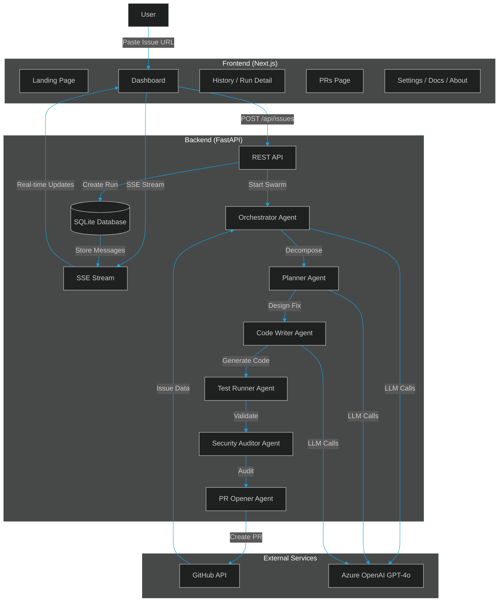

### Flow

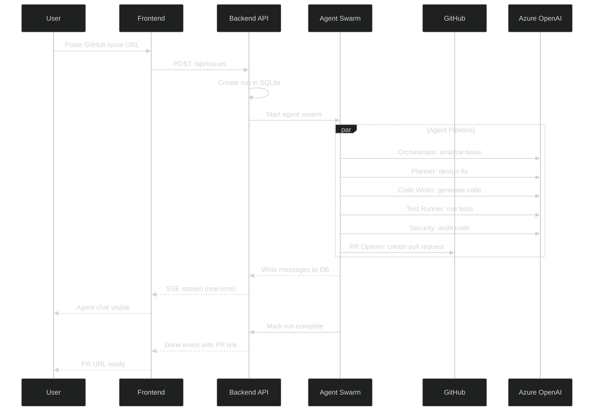

---

## User journey

From first visit to merged-ready PR link.

```mermaid
%%{init: {'theme':'dark', 'themeVariables': { 'primaryColor': '#1e293b', 'primaryTextColor': '#e2e8f0', 'lineColor': '#8b5cf6' }}}%%
flowchart LR
    A([Visit /]) --> B[Read value prop]
    B --> C[Click Try Auto-Fix]
    C --> D([/dashboard])
    D --> E[Paste GitHub issue URL]
    E --> F{Valid URL?}
    F -->|No| E
    F -->|Yes| G[POST /api/issues]
    G --> H[Receive run_id]
    H --> I[Open SSE stream]
    I --> J[Watch agent chat]
    J --> K[See diff + tests + security]
    K --> L{Run done?}
    L -->|No| J
    L -->|Yes| M[Click PR link]
    M --> N([Review on GitHub])

    style A fill:#6366f1,color:#fff
    style D fill:#6366f1,color:#fff
    style N fill:#10b981,color:#fff
```

---

## Agent pipeline

Agents execute **sequentially**. Each step reads shared run context and appends messages the UI streams immediately.

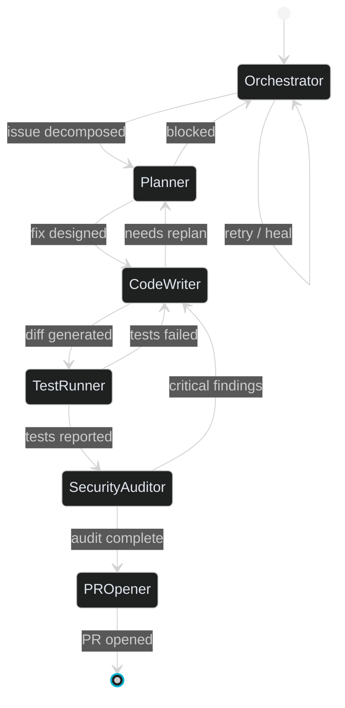

### Agent responsibilities

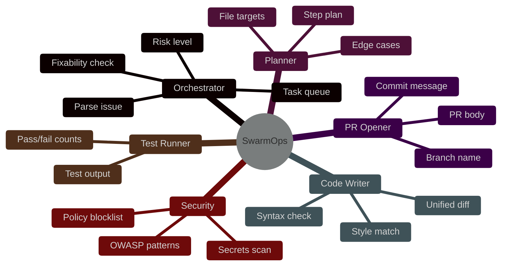

| Agent | Input | Output | Message `type` |
|-------|--------|--------|----------------|
| **Orchestrator** | GitHub issue JSON | Task plan, complexity | `status`, `plan` |
| **Planner** | Tasks + repo context | File-level strategy | `status`, `plan` |
| **Code Writer** | Plan | Diff, `files_changed` | `code` |
| **Test Runner** | Diff | Pass/fail, logs | `test` |
| **Security Auditor** | Diff + files | Findings list | `security` |
| **PR Opener** | All artifacts | `pr_url`, branch | `pr` |

---

## Docker deployment

Production-like local stack with one command.

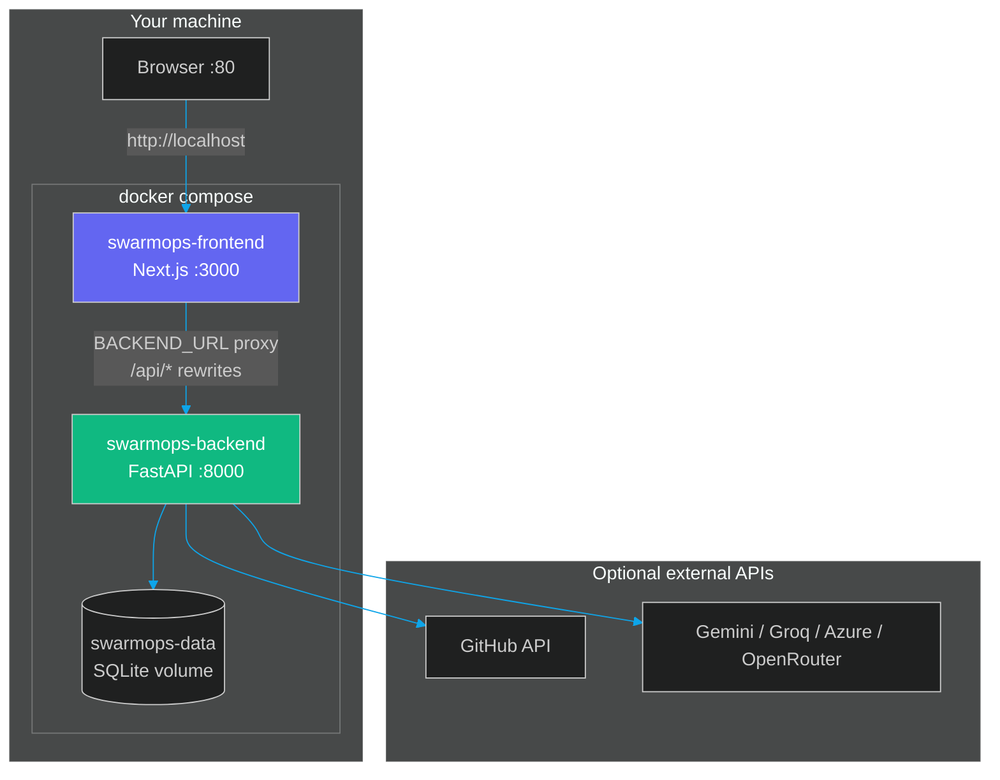

| Service | Image | Host port | Internal |
|---------|-------|-----------|----------|
| `frontend` | `frontend/Dockerfile` | **80** → 3000 | `BACKEND_URL=http://backend:8000` |
| `backend` | `backend/Dockerfile` | **8000** | Health: `GET /health` |
| `swarmops-data` | Named volume | — | `/data/swarmops.db` |

---

## Frontend architecture

Next.js 16 App Router with client-side SSE and Zustand stores.

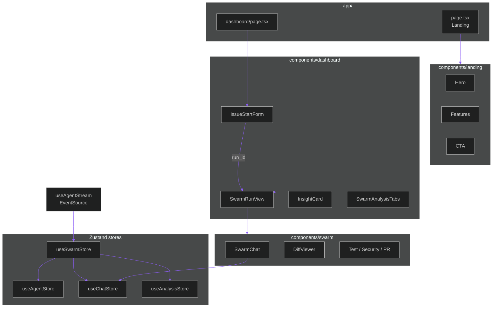

| Route | Components | Data |
|-------|------------|------|
| `/` | Hero, Features, CTA | Static |
| `/dashboard` | IssueStartForm → SwarmRunView | `POST /api/issues`, SSE |

---

## Data model

SQLite schema via SQLAlchemy. One run has many messages and per-agent states.

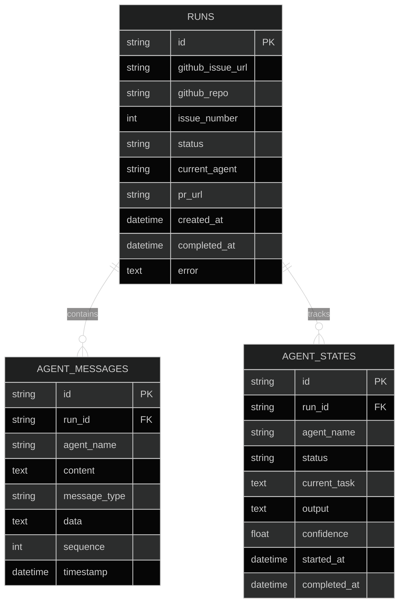

---

## LLM provider router

`backend/services/llm.py` tries providers in `LLM_PROVIDER` order, then auto-detects credentials, then uses deterministic fallback text.

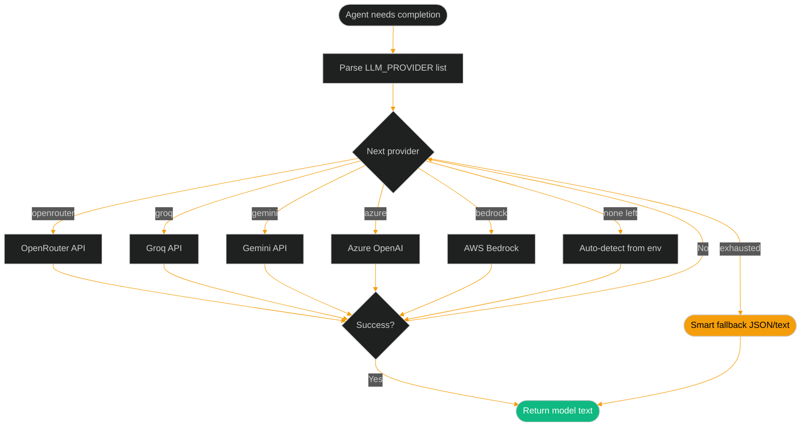

Example: `LLM_PROVIDER=gemini,groq,azure` — uses Gemini first; on rate limit or error, falls through to Groq, then Azure.

---

## SSE real-time events

The dashboard opens `EventSource('/api/stream/{run_id}')`. The backend polls SQLite every **500ms** and emits JSON lines.

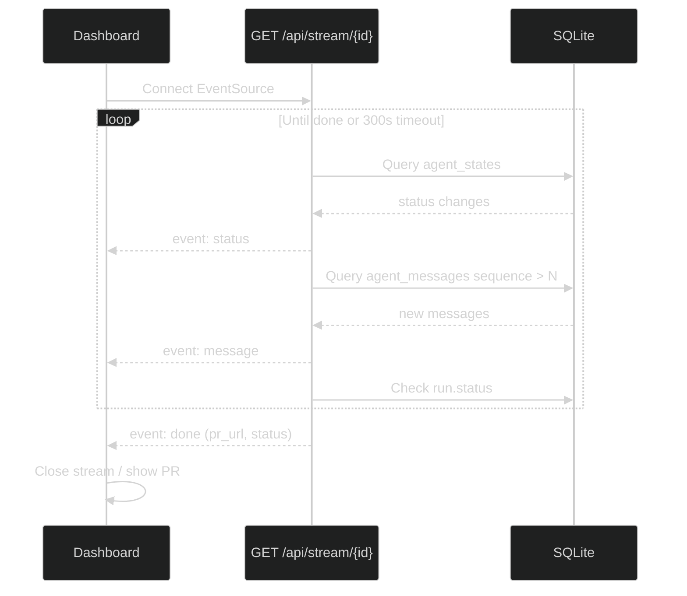

### SSE payload types

| `event` field | When fired | Key fields |
|---------------|------------|------------|
| `status` | Agent state changes | `agent`, `status` |
| `message` | New agent output | `agent`, `content`, `type`, `data`, `sequence` |
| `done` | Run completed or failed | `status`, `pr_url`, `error` |
| `timeout` | Stream exceeded 5 min | `message` |

### Message `type` values (in `message` events)

| `type` | UI panel |
|--------|----------|
| `status` | Agent chat |
| `plan` | Analysis tabs |
| `code` | Diff viewer (`data.diff`, `files_changed`) |
| `test` | Test panel (`tests_passed`, `tests_failed`) |
| `security` | Security panel (`findings`, `passed`) |
| `pr` | PR panel (`pr_number`, `branch`) |

---

## Run lifecycle

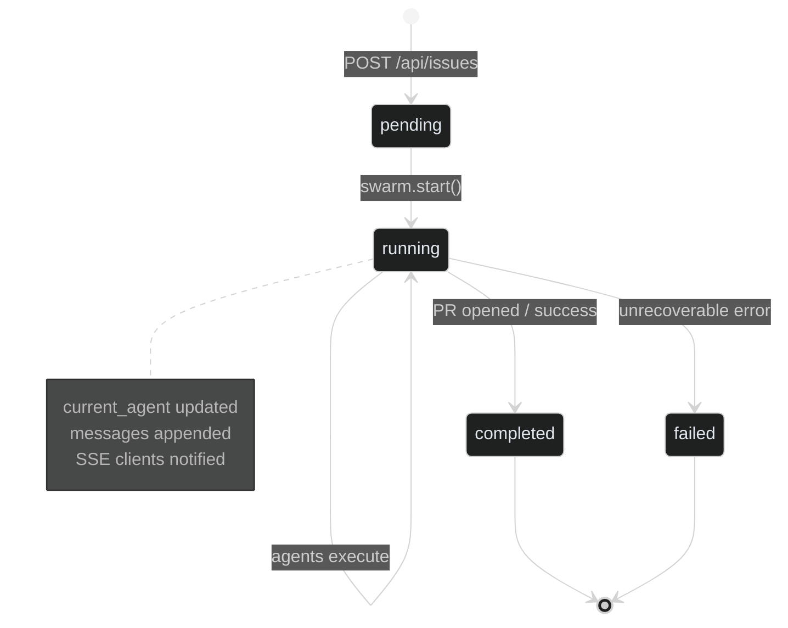

---

## Dashboard layout

Three-column live run view (desktop).

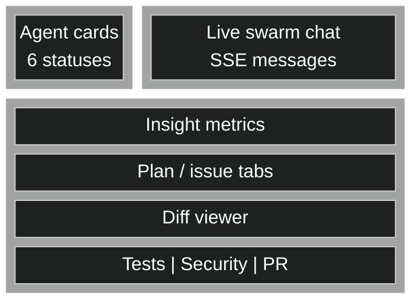

Mobile: stacks vertically — chat first, then agents, then insights.

---

## Self-healing retries

When validation fails, context flows backward in the pipeline.

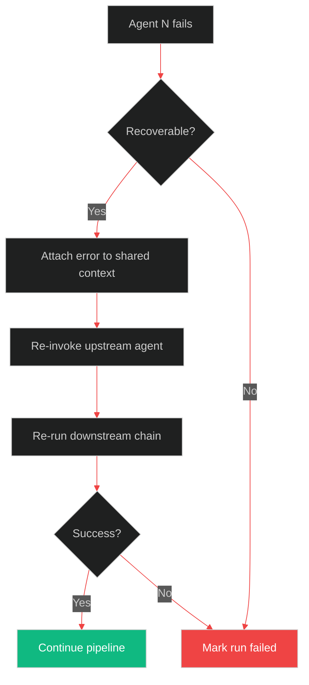

---

## CI/CD pipeline

GitHub Actions on every push/PR to `main` or `master`.

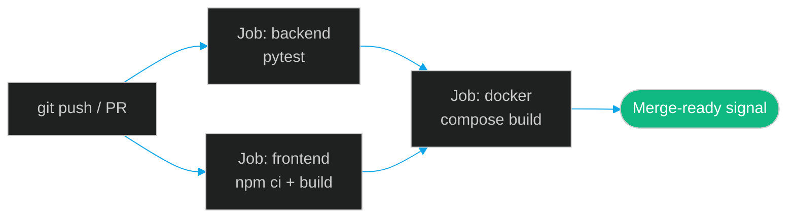

---

## How the agent swarm works

Agents run **in order**, sharing run context stored in SQLite. Each agent emits structured messages that the frontend consumes over SSE.

Pipeline (ASCII):

```
┌─────────────┐    ┌─────────┐    ┌────────────┐    ┌────────────┐    ┌────────────────┐    ┌──────────┐
│ Orchestrator │───▶│ Planner │───▶│ Code Writer│───▶│Test Runner │───▶│Security Auditor│───▶│PR Opener │
│  Reads Issue │    │Designs  │    │  Generates │    │  Validates │    │   Scans for    │    │Creates   │
│  Decomposes  │    │  Fix    │    │  Code Diff │    │   Tests    │    │Vulnerabilities │    │   PR     │
└─────────────┘    └─────────┘    └────────────┘    └────────────┘    └────────────────┘    └──────────┘
```

Supporting modules:

- **`swarm.py`** — Orchestration loop, agent registration, context passing
- **`file_resolver.py`** — Picks relevant source files for the issue
- **`services/github.py`** — Issue fetch, branch/PR creation
- **`services/llm.py`** — Provider router and fallbacks

---

## Prerequisites

| Tool | Version | Purpose |
|------|---------|---------|
| Python | 3.11+ | Backend runtime |
| Node.js | 20+ | Frontend (Next.js 16) |
| Git | Any | Clone and PR workflow |
| Docker (optional) | Recent | One-command demo |
| GitHub token | `repo` scope | Real issues and PRs (optional for demo) |
| LLM API key | Any supported provider | Live reasoning (optional; fallback available) |

---

## Quick start

### Option A — Docker (recommended for demos)

```bash
cp .env.example .env
# Edit .env — set GEMINI_API_KEY and/or GITHUB_TOKEN (optional for fallback demo)
docker compose up --build -d
```

Open **<http://localhost>** → **Dashboard** → paste an issue URL → **Auto-Fix Issue**.

Windows shortcut: `start-docker.bat`

**Demo issue (public, no private repo needed):**

`https://github.com/microsoft/vscode/issues/227757`

### Option B — Local development

**Backend**

```bash
cd backend
python -m venv venv
# Windows: venv\Scripts\activate
# macOS/Linux: source venv/bin/activate
pip install -r requirements.txt
cp .env.example .env
uvicorn main:app --reload --host 0.0.0.0 --port 8000
```

**Frontend**

```bash
cd frontend
npm install
set BACKEND_URL=http://127.0.0.1:8000   # Windows
# export BACKEND_URL=http://127.0.0.1:8000   # macOS/Linux
npm run dev
```

Open **<http://localhost:3000>**

**Both at once (Windows):** `start-all.bat`

---

## Environment variables

Copy `.env.example` to `.env` at the **repo root** (used by Docker Compose). For local backend-only dev, mirror vars in `backend/.env`.

| Variable | Description |
|----------|-------------|
| `GITHUB_TOKEN` | Personal access token with `repo` — [create token](https://github.com/settings/tokens) |
| `LLM_PROVIDER` | Comma-separated priority, e.g. `gemini,groq,azure` |
| `GEMINI_API_KEY` | Google Gemini |
| `GROQ_API_KEY` | Groq |
| `OPENROUTER_API_KEY` | OpenRouter |
| `AZURE_OPENAI_ENDPOINT` | Azure OpenAI endpoint |
| `AZURE_OPENAI_KEY` | Azure OpenAI key |
| `AZURE_OPENAI_DEPLOYMENT` | Deployment name (e.g. `gpt-4o`) |
| `DATABASE_URL` | SQLite path (default `sqlite:////data/swarmops.db` in Docker) |
| `CORS_ORIGINS` | Allowed frontend origins |
| `FRONTEND_URL` | Used in links and CORS |

### With vs without credentials

| Capability | No keys | With keys |
|------------|---------|-----------|
| Landing + dashboard UI | Yes | Yes |
| SSE agent stream | Yes | Yes |
| LLM reasoning | Smart fallback text | Live model output |
| GitHub issue body | Mock/sample | Real issue |
| Open PR | Simulated PR URL | Real PR on GitHub |

---

## Frontend

Next.js 16 App Router, Tailwind CSS 4, shadcn/ui, Framer Motion, Zustand.

| Route | Description |
|-------|-------------|
| `/` | Landing — hero, six agents, CTA |
| `/dashboard` | Issue input, live swarm chat, agent cards, insights, diff, tests, security, PR |

The dashboard connects to `POST /api/issues`, then opens `EventSource` on `GET /api/stream/{run_id}` for real-time updates.

---

## API reference

Base URL: `http://localhost:8000` (Docker backend) or proxied via Next.js rewrites in dev (`BACKEND_URL`).

| Method | Endpoint | Description |
|--------|----------|-------------|
| `GET` | `/health` | Health check and provider status |
| `GET` | `/` | API welcome payload |
| `POST` | `/api/issues` | Start a swarm run from a GitHub issue |
| `GET` | `/api/issues/{run_id}` | Run status and agent states |
| `GET` | `/api/stream/{run_id}` | **SSE** stream of agent events |
| `GET` | `/api/prs` | List PRs created by SwarmOps |
| `GET` | `/api/prs/{run_id}` | PR details for one run |
| `GET` | `/api/runs` | Paginated run history (`limit`, `offset`, `status`) |
| `GET` | `/api/runs/stats` | Totals: completed, failed, running |

Interactive OpenAPI docs: **<http://localhost:8000/docs>** (when backend is running).

### Start a run

```bash
curl -X POST http://localhost:8000/api/issues \
  -H "Content-Type: application/json" \
  -d '{
    "github_url": "https://github.com/microsoft/vscode/issues/227757",
    "repo": "microsoft/vscode",
    "issue_number": 227757
  }'
```

Response includes `run_id`. Stream events:

```bash
curl -N http://localhost:8000/api/stream/<run_id>
```

---

## Project structure

```
microsoft-hackathon/
├── backend/
│   ├── main.py                 # FastAPI entry (uvicorn main:app)
│   ├── config.py               # Settings from environment
│   ├── database.py             # SQLAlchemy + SQLite
│   ├── models.py               # Run, AgentMessage, AgentState
│   ├── swarm.py                # Swarm orchestration loop
│   ├── requirements.txt
│   ├── Dockerfile
│   ├── api/
│   │   ├── issues.py           # POST/GET issues & runs
│   │   ├── stream.py           # SSE endpoint
│   │   ├── prs.py              # PR listing
│   │   └── runs.py             # History & stats
│   ├── agents/
│   │   ├── orchestrator.py
│   │   ├── planner.py
│   │   ├── code_writer.py
│   │   ├── test_runner.py
│   │   ├── security_auditor.py
│   │   ├── pr_opener.py
│   │   └── file_resolver.py
│   ├── services/
│   │   ├── llm.py              # Multi-provider LLM router
│   │   └── github.py           # PyGithub wrapper
│   └── tests/
├── frontend/
│   ├── app/                    # Next.js routes (/, /dashboard)
│   ├── components/             # UI, landing, swarm panels, chat
│   ├── store/                  # Zustand (swarm, chat, agents)
│   ├── hooks/useAgentStream.ts # SSE client
│   ├── services/swarm.service.ts
│   ├── next.config.ts          # Standalone build + API rewrites
│   └── Dockerfile
├── docker-compose.yml
├── .env.example
├── .github/workflows/ci.yml
└── README.md
```

---

## Tech stack

### Backend

| Technology | Purpose |
|------------|---------|
| **FastAPI** | REST API + SSE |
| **SQLite + SQLAlchemy** | Runs, messages, agent state |
| **PyGithub** | Issues and pull requests |
| **Multi-provider LLM service** | Gemini, Groq, OpenRouter, Azure OpenAI (+ fallback) |

### Frontend

| Technology | Purpose |
|------------|---------|
| **Next.js 16** | App Router, standalone Docker image |
| **React 19** | UI |
| **TypeScript** | Type safety |
| **Tailwind CSS 4 + shadcn** | Dark glass UI |
| **Zustand** | Client state |
| **Framer Motion** | Landing and panel motion |
| **EventSource (SSE)** | Live agent stream |

---

## Troubleshooting

| Symptom | Likely cause | Fix |
|---------|--------------|-----|
| Dashboard cannot start run | Backend down or wrong `BACKEND_URL` | Start backend; set `BACKEND_URL=http://127.0.0.1:8000` for `npm run dev` |
| SSE stops with `timeout` | Run exceeded 5 minutes | Restart run; check backend logs |
| `CORS` error in browser | Origin not allowed | Add your URL to `CORS_ORIGINS` in `.env` |
| Empty agent messages | No LLM keys | Expected in fallback mode — add `GEMINI_API_KEY` or Azure keys |
| PR link is example.com | No `GITHUB_TOKEN` | Add token with `repo` scope for real PRs |
| Docker frontend 502 | Backend not healthy | `docker compose logs backend`; wait for healthcheck |
| `Invalid GitHub URL` | Wrong issue URL format | Use `https://github.com/owner/repo/issues/123` |

**Logs**

```bash
docker compose logs -f backend
docker compose logs -f frontend
```

---

## FAQ

**Can I use a private repository?**  
Yes, with a `GITHUB_TOKEN` that has access to that repo.

**Does it modify my default branch directly?**  
No — the PR Opener creates a feature branch and opens a PR for review.

**Which LLM is best for the hackathon demo?**  
Gemini (`GEMINI_API_KEY`) is the quickest free-tier setup; Azure OpenAI fits the Microsoft theme.

**Can multiple runs execute in parallel?**  
Each `POST /api/issues` creates an independent `run_id`; runs are isolated in SQLite.

**Is AutoGen required?**  
The production path uses the custom `swarm.py` orchestrator; LLM calls go through `services/llm.py`.

---

## Demo script (~3 minutes)

| Time | Action |
|------|--------|
| 0:00–0:30 | Show a real GitHub issue (bug or small enhancement) |
| 0:30–1:00 | Open dashboard, paste URL, click **Auto-Fix Issue** |
| 1:00–1:30 | Highlight live agent chat and status cards (SSE) |
| 1:30–2:00 | Show diff, test results, security panel, PR link |
| 2:00–2:30 | Walk **Agent pipeline** and **SSE** diagrams |
| 2:30–3:00 | Show **Docker deployment** diagram — one-command judge setup |

---

## Deployment

| Method | Command | URL |
|--------|---------|-----|
| Docker Compose | `docker compose up --build -d` | <http://localhost> |
| Local dev | `start-all.bat` or backend + `npm run dev` in `frontend/` | <http://localhost:3000> |
| Production build | `cd frontend && npm run build && npm start` | Port 3000 |

Health: `GET http://localhost:8000/health`

CI runs `pytest` in `backend/`, `npm run build` in `frontend/`, and `docker compose build` on push/PR to `main`/`master`.

---

## Team

| Area | Focus |
|------|-------|
| Backend + agents | FastAPI, swarm pipeline, SQLite, GitHub |
| Frontend | Next.js dashboard, SSE, UX |
| AI | LLM router, agent prompts, Azure/Gemini integration |

---

## License

MIT — Hackathon project for **Microsoft Build with AI 2026**.
